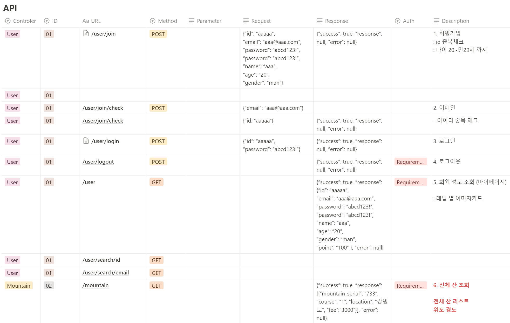
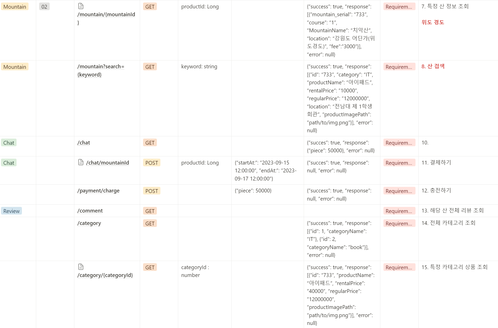
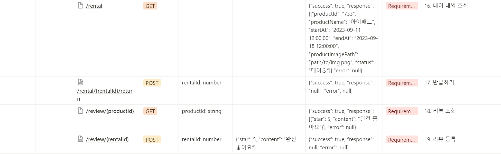
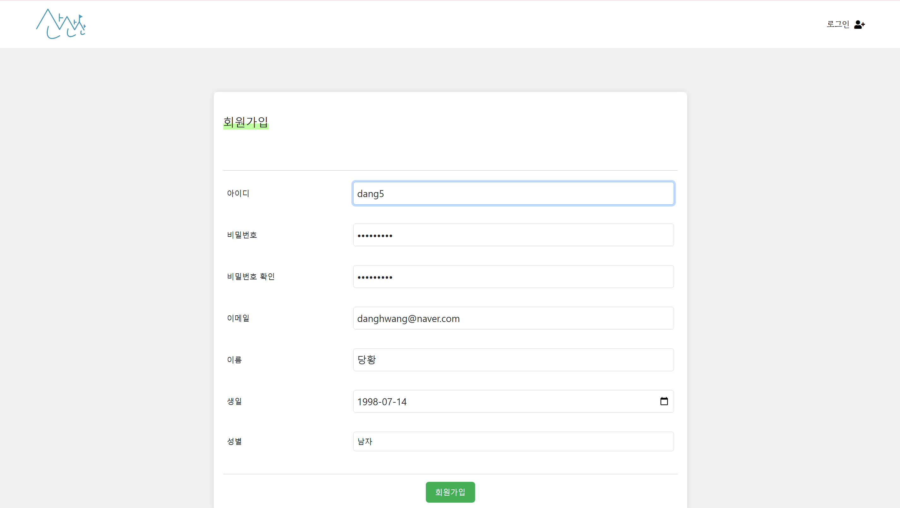
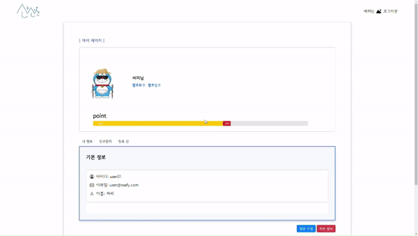
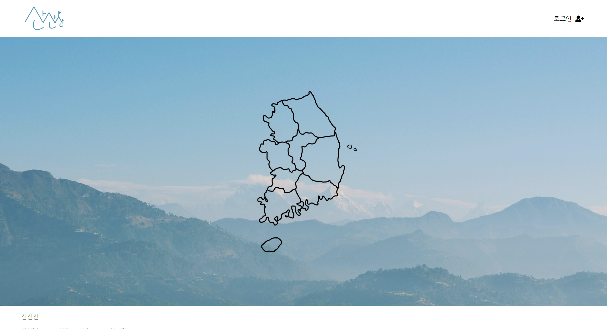

# 산산산 프로젝트 🚩

다양한 API를 활용해 전국 산 정보와 등산 정보를 제공하는 사이트

 

## 📆 개발 기간

> 24.05.17 - 24.05.24

## 👩🏻‍🏫 프로젝트 소개

- 수도권 / 강원도 / 충청도 / 전라도 / 경상도 / 제주도로 나누어 전국의 산 정보를 제공
- Kakao Map api와 weather api를 통해 실질적으로 필요한 정보 제공
- 등반한 산 포인트를 토대로 레벨 부여와 프로필 변화를 통해 동기 부여
- 친구 기능을 통해 등산 욕구 고취

 

### 👫 멤버 소개

<table>
    <tr>
        <td align="center">
          
        </td>
        <td align="center">
          
        </td>
    </tr>
    <tr>
        <td align="center">
          <a href="YOUR_GIT_URL_1">
            이소연
          </a>
        </td>
        <td align="center">
          <a href="YOUR_GIT_URL_2">
            최승탁
          </a>
        </td>
    </tr>
    <tr>
        <td align="center">
            FE, BE, 팀장👑
        </td>
        <td align="center">
            FE, BE
        </td>
    </tr>
</table>

 

### 🌳 API 명세서

 

### ⚙️ 개발 환경

- `JDK 17.0.1`
- **IDE** : STS 4, Eclipse
- **Framework** : Springboot, JWT

- **Database** : MySQL
- **ORM** : Mybatis
- **api** : Kakao Map api, 공공데이터 Weather api

### &nbsp; 🥨 FrontEnd

|           | STACK      |
| --------- | ---------- |
| Language  | Javascript |
| Framework | Vue        |

### &nbsp; 🥨 BackEnd

|           | STACK      |
| --------- | ---------- |
| Language  | Java 17    |
| Framework | Springboot |
| JWT       | JWT 0.12.5 |
| Database  | MySQL      |

### &nbsp; 🥨 Communication

|                   | STACK          |
| ----------------- | -------------- |
| Sprint Management | Notion         |
| Tools             | Figma, Swagger |

 

## 📌 주요 화면

#### 로그인

  

- 로그인 전에도 산의 위치, 정보는 얻을 수 있음

#### 회원가입

- JWT 토큰 관리를 통해 로그인 구현

#### 마이페이지

- 회원 정보 조회/수정/삭제
- 등반 내역 확인
- 팔로잉, 팔로워 친구 조회/추가/삭제

#### 메인페이지

- 로그인 전 / 로그인 후 페이지 제한

 

## 👪 팀원 기능

| 이름   | 역할                 | 
개발 내용
                                                                                                                                                                                                                                                                                                                                                                                                                                                                                                                                                  |
| ------ | -------------------- | ------------------------------------------------------------------------------------------------------------------------------------------------------------------------------------------------------------------------------------------------------------------------------------------------------------------------------------------------------------------------------------------------------------------------------------------------------------------------------------------------------------------------------------------------------------------------------------ |
| 이소연 | Full-Stack 팀장 | - DB 설계  - 게시글 조회/등록/삭제 BE 설계     - 데일리 미션 도메인 개발                                                                                                                                                                                                                                                                                                                                                                                                                                                                                                   |
| 최승탁 | Full-Stack           | - DB 설계 - JWT 관리     - 로그인 도메인 개발     - 회원가입 도메인 개발     - 아이디 찾기 도메인 개발     - 비밀번호 재설정 도메인 개발     - 회원 정보 조회 및 수정 도메인 개발 - SMTP Server, Redis를 이용한 이메일 인증 기능 구현 - 스프링 시큐리티, JWT를 이용한 인증 구현 - EC2 인프라 환경 세팅 - 프론트엔드, 백엔드 EC2 배포 - Github Action, Jenkins, Docker를 활용한 CI/CD - Letsencrypt, Certbot을 이용한 서비스 SSL 보안 적용 - Nginx 웹서버 적용(Load Balancing, Reverse Proxy, Service Redirect 설정) |
|  |

## 📌 겪었던 어려움과 해결 과정

1. **초기설계의 부재에 따른 회의 증가**

- 기획을 처음하기에 꼼꼼한 설계를 하지 못했습니다. 개발에 들어간 후 DB 설계의 누락, API Response의 설계 부족 등을 겪으며 DB, API 명세서, Vue의 Component를 계속해서 수정하며 회의가 증가하게 되었습니다. 이를 통해 꼼꼼한 설계를 바탕으로 프로젝트를 진행해야 한다고 알게 되었습니다.

2. **날씨 api**

- 기존 기상청 날씨누리 api를 사용했을 때 산 봉우리의 날씨가 일치하지 않는 오류가 있었습니다. 고도와 위도가 잘못된 오류라 생각하고 DB를 수정했지만 날씨가 일치하지 않는 오류가 계속 돼서 팀원과 함께 문제점을 찾아보니 산악 날씨 데이터는 따로 제공된다는 점을 알게 되었습니다.

 

## 💓 소감

> 이소연

- 삼성 청년 sw 아카데미에서 학습했던 api와 rest api를 활용해서 구현해보았습니다. 일주일 동안 온전히 둘이서 하는 프로젝트는 처음이라 서툰 부분도 많았고 해결하는 데 시간도 더 걸린 부분도 있었습니다. 아직 완전한 이해를 하지 못한 부분도 많아 팀원의 도움을 많이 받아 프로젝트를 진행했습니다.
  이 경험을 토대로 하반기 프로젝트를 위해 api와 로그인 보안기능, JPA에 대해 공부하고 연습해보겠습니다.

> 최승탁

- 삼성 청년 SW 아카데미에서 1학기에서 학습한 내용을 바탕으로 프로젝트를 크런치 타임을 진행했습니다. 실제 프로젝트에 JWT 등 처음으로 적용해 보았지만, Spring Security를 적용하지 못해 아쉬웠습니다. 아쉬움이 많이 남는 프로젝트인 만큼 앞으로 더 배우고 성장하고 싶습니다.
